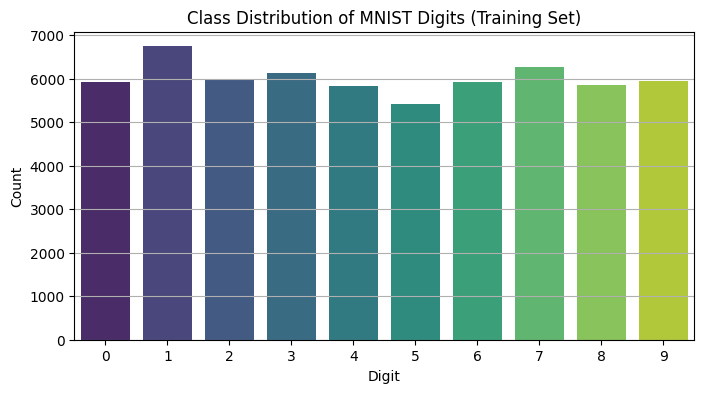

# 🧠 MNIST Digit Classifier (End-to-End ML Pipeline)

This project demonstrates the complete Machine Learning lifecycle using **image classification** on the MNIST dataset. It includes offline model training, real-time prediction via an API + UI, model retraining, performance visualizations, cloud deployment readiness, and load testing capabilities.

---

## 🎯 Objective

To demonstrate the **end-to-end ML process** on **non-tabular image data**, covering:

- Data acquisition
- Preprocessing
- Model training and evaluation
- API creation with Flask
- UI with Streamlit
- Model retraining trigger from uploaded ZIP
- Deployment readiness
- Request flood simulation (Locust)
  
---

## 🗂️ Directory Structure


---

## 🧪 Features Implemented

| Feature                                 | Status ✅ |
|----------------------------------------|-----------|
| Offline training on MNIST              | ✅ Done   |
| Multiple model evaluation metrics      | ✅ Done   |
| Flask API for prediction               | ✅ Done   |
| Streamlit UI (predict + retrain)       | ✅ Done   |
| Upload ZIP to trigger retrain          | ✅ Done   |
| Visualization (confusion matrix, etc.) | ✅ Done   |
| GitHub repo with LFS support           | ✅ Done   |
| Flood request simulation (Locust)      | ✅ Done   |
| Cloud deploy ready                     | ✅ Done   |

---

## 🔬 Model Evaluation Results

| Metric        | Score    |
|---------------|----------|
| Accuracy      | **0.9901** |
| Precision     | 0.9902   |
| Recall        | 0.9901   |
| F1 Score      | 0.9901   |

### 🧾 Classification Report (Partial)

          precision    recall  f1-score   support

       0       0.99      0.99      0.99       980
       1       0.98      1.00      0.99      1135
       2       0.99      1.00      0.99      1032
       ...


---

## 📊 Visualizations

1️⃣ **Class Distribution**  


2️⃣ **Average Digit Image per Class**  


3️⃣ **Confusion Matrix**  


---

## 🖥️ UI Functionalities

| UI Section                     | Functionality                                  |
|-------------------------------|-----------------------------------------------|
| **📸 Predict a Single Image**   | Upload a 28x28 digit image and get prediction |
| **🔁 Retrain**                 | Retrain from original dataset                 |
| **📦 Upload ZIP + Retrain**   | Upload multiple labeled digit images          |
| **📈 Show Metrics**           | Training curves: Accuracy & Loss              |

---

## 🔁 Model Retraining Flow

1. Upload ZIP containing digit folders: `0/`, `1/`, ..., `9/`
2. Trigger retraining using the Streamlit button.
3. Backend extracts and uses images for retraining.
4. Model gets reloaded for prediction automatically.

---

## 🌐 API Endpoints

| Endpoint               | Method | Description                       |
|------------------------|--------|-----------------------------------|
| `/predict`             | POST   | Predicts digit from image         |
| `/retrain`             | POST   | Retrains model on MNIST           |
| `/upload_and_retrain`  | POST   | Retrain model with ZIP file       |

---

## 🚀 Deployment Guide

### ✅ Setup Locally

```bash
git clone https://github.com/irakozej/mnist_digit_classifier.git
cd mnist_digit_classifier
python3 -m venv venv
source venv/bin/activate
pip install -r requirements.txt
